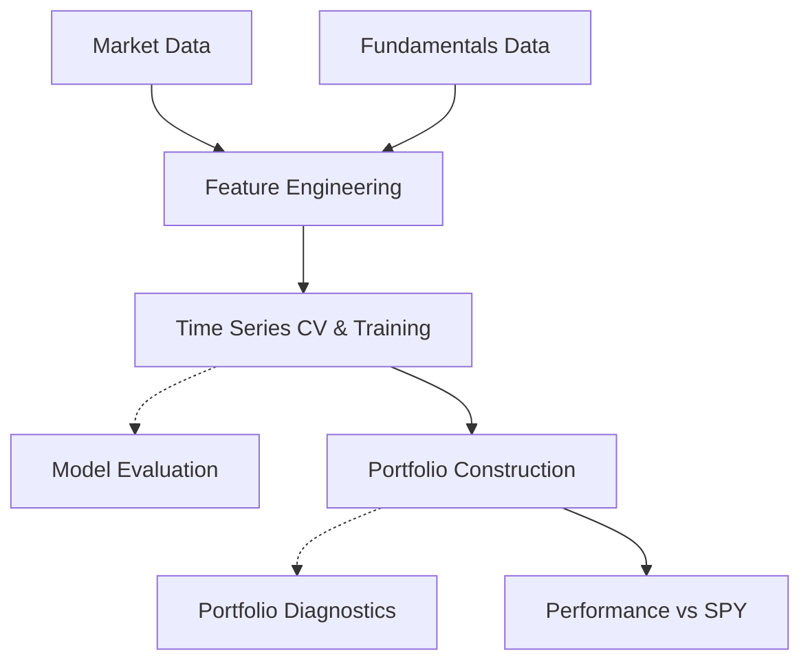

# Financial-ML

A machine learning system for equity selection that predicts which S&P 500 stocks will outperform the market benchmark. The project combines market data with company fundamentals to construct long/short portfolios, using time series cross-validation to prevent lookahead bias and comprehensive backtesting to validate performance against SPY. The goal: identify stocks with positive alpha while maintaining robust risk management through systematic validation at both model and portfolio levels

## Key Results

| Metric | Strategy | SPY Benchmark | Difference |
|--------|----------|---------------|------------|
| **Sharpe Ratio** | **0.80** | 0.55 | +45% |
| **Annual Return** | **17.9%** | 13.5% | +4.4% |
| **Annual Alpha** | **2.29%** | -| - |
| **Max Drawdown** | **-21.5%** | -24.0% | Better |
| **Total Return (2016-2025)** | **323.6%** | ~190% | +133% |
| **Win Rate** | **67%** | - | - |


- **Statistically significance:** p < 0.001 (Bonferroni-adjusted, 3-model comparison)  
- **Transaction costs included:** After including an estimation of transaction costs , Net alpha → 2.18% after 0.82% annual drag  
- **Robustness across regimes:** Outperformed in COVID crash (-21.5% vs -24%) and in 2022 bear market

- Including a **Probability calibration** (isotonic regression) improved Sharpe from 0.71 → 0.80 (+13%)
## Pipeline Architecture

The pipeline of this project follows a standard MLOps workflow: data ingestion → feature engineering → model training with time series cross-validation → portfolio construction → backtesting.


***
## Table of Contents
- [Features](#features)
- [Project structure](#project-structure)
- [Installation](#installation)
- [Quick start](#quick-start)
- [Data Collection](#data-collection)
- [Modelling](#modelling)
- [Evaluation](#evaluation)
- [Portfolio construction and backtesting](#portfolio-construction-and-backtesting)
- [Documentation](#documentation)


## Features

- Fetch the current S\&P 500 list, normalize tickers for the market data API, and persist the symbols table.
- Download monthly adjusted close prices for all S\&P 500 tickers and the benchmark instrument, writing tidy CSVs for full or test universes.
- Retrieve selected fundamentals (assets, liabilities, equity, revenues, net income, EPS, shares outstanding) from public filings and save as a long-format CSV.
- Combine fundamentals and market information to produce ticker features (e.g momentum, volatility, ROA, ROE...).
- Define an excess-return land evaluate baseline classifiers with expanding-window time series splits.
- Produce out-of-fold predictions per date and ticker for analysis and diagnostics.
- Use the predictions for the best and worst performing tickers to generate portfolios following different strategies, to try and beat the market.
- Assess the model robustness and the qualities of the portfolios (e.g. Sharpe ratios,  profits, risks, volatity vs SPY). 

## Project structure
The project is structured as follows (**For a more detailed explanation please refer to** [`docs/methodology.md`](docs/methodology.md)
):
```bash
financial-ml/
├── src/financial_ml/ # Source code
│ ├── data/ # Data pipeline & feature engineering
│ ├── models/ # Training with time series CV
│ ├── evaluation/ # Model diagnostics
│ └── portfolio/ # Backtesting & construction
├── docs/ # Technical documentation
├── figures/ # Performance charts
└── requirements.txt
```

### Key Modules

**Data Pipeline (`data/`):**
- Downloads market data (yfinance) and fundamentals (SEC EDGAR)
- Engineers 14 features (momentum, value, quality, risk)
- Handles missing data and forward-fills quarterly fundamentals

**Model Training (`models/`):**
- 3-fold expanding window time series CV
- Trains Random Forest + isotonic calibration
- Saves trained models and predictions

**Evaluation (`evaluation/`):**
- Feature importance analysis
- Model diagnostics (AUC, calibration metrics)
- Cross-fold performance comparison

**Portfolio Construction (`portfolio/`):**
- Selects top/bottom 10% stocks by predicted probability
- Constructs equal-weighted long/short portfolios
- Backtests against SPY benchmark


## Installation

**Requirements:** Python ≥ 3.10

### Quick Install

```bash
# Clone repository
git clone https://github.com/pmatorras/financial-ml.git
cd financial-ml

# Create virtual environment (recommended)
python -m venv .venv
source .venv/bin/activate  # Windows: .venv\Scripts\activate

# Install package in editable mode
pip install -e .
```

### Reproducible Install

For exact dependency versions used in development:

```bash
pip install -r Requirements.txt
pip install -e .
```

>**Note:** The package will be installed as `financial_ml` and can be run via `python -m financial_ml <command>`.

## Quick start

### Complete ML Pipeline

Run the full pipeline from data collection to backtesting:
```bash
# 1. Collect market data (downloads S&P 500 prices)
python -m financial_ml market
# 2. Fetch fundamentals from SEC EDGAR
python -m financial_ml fundamentals

#3. Train models
python -m financial_ml train

#4. Anayse training results
python -m financial_ml analyze

#5. Create portfolio and backtests
python -m financial_ml portfolio --model rf
```
**Output:** Models saved to `models/`, predictions to `predictions/`, and performance plots to `figures/`.

### Fast Development Mode

For quick iterations using a subset of ~50 stocks:

```bash
# Download test subset
python -m financial_ml market --test

# Train on subset (market features only, faster)
python -m financial_ml train --test --no-fundamentals

# Backtest
python -m financial_ml portfolio --model rf --test
```

### Global Flags

Available for all commands:

**`--test`**
- Uses subset of ~50 stocks instead of full S&P 500
- Appends `_test` suffix to data files

**`--debug`**
- Enables verbose logging
- Designed for pipeline validation with minimal data (1-2 stocks)
- Saves artifacts to `debug/` directories with `_debug` suffix

**Examples:**
```bash
#Development mode (small subset)
python -m financial_ml train --test

#Debug mode (verbose logging + debug artifacts)
python -m financial_ml train --debug

#Combined for troubleshooting
python -m financial_ml train --test --debug
```

> **Tip:** Use `python -m financial_ml --help` to see all available commands and flags.
  

## Data Collection

<a id="data-usage"></a>
### Usage

```bash
# 1. Download S&P 500 constituent list and prices
python -m financial_ml market

# 2. Download company fundamentals from SEC EDGAR
python -m financial_ml fundamentals

# Test mode (subset of ~50 stocks)
python -m financial_ml market --test
python -m financial_ml fundamentals --test
```
**Command specific flags**
```bash
- `--newtable, -nt` - Refresh S&P 500 constituent list from public source
- `--newinfo, -ni` - Redownload all historical price data (ignores cache)

```
**Caching behaviour:** By default, data files are only downloaded if they don't already exist. Use `--newtable` and `--newinfo` to force refresh.

> **Note:** Market data collection and fundamentals collection are separate commands to enable independent execution. You can update constituents and prices without re-fetching fundamentals, or vice versa.

### Data sources 
Two types of data are currently considered: market and fundamental data:
1. **Market Data** (via yfinance)

    - **Universe:** S\&P 500 constituents scraped from public reference
    - **Prices:** Monthly adjusted close prices for all symbols + SPY benchmark
    - **Normalization:** Ticker symbols standardized for API compatibility

2. **Fundamental Data** (via SEC EDGAR API)

    - **Source:** Company 10-K/10-Q filings
    - **Tags:** Selected US-GAAP financial metrics (revenues, assets, equity, etc.)
    - **Processing:** Point-in-time series, de-duplicated by metric/unit/date
    - **Variants:** Multiple tag variants to handle company-specific reporting differences

> **Note:** Some fundamentals use different US-GAAP tag variants (e.g., `Revenues`, `RevenueFromContractWithCustomerExcludingAssessedTax`) to capture data across different reporting formats.

<a id="data-output"></a>
### Output Files

| File | Description | 
| :-- | :-- | 
| `data/market/sp500_list.csv` | S\&P 500 constituent tickers | 
| `data/market/sp500_prices.csv` | Monthly adjusted close prices | 
| `data/fundamentals/sp500_fundamentals.csv` | Company fundamentals from SEC | 

### Target Variable

**Binary classification:** Predict whether a stock will outperform the S\&P 500 benchmark.

**Label definition:** `y = 1` if stock's 12-month forward return exceeds SPY's 12-month forward return, else `y = 0`.

This creates a **relative momentum** signal focused on identifying stocks that beat the market, suitable for long/short portfolio construction.

***

## Modelling

<a id="modelling-usage"></a>
### Usage

```bash
# Train with fundamentals (default)
python -m financial_ml train

# Market data only (skip fundamentals)
python -m financial_ml train --no-fundamentals
```

**Command specific tags**
- `--no-fundamentals` - Train using only market data (excludes fundamental ratios)

### Features

The model uses **14 features** spanning market and fundamental factors:

**Market Signals (5):**
- Momentum: `r12`, `mom121` (12-month trend)
- Volatility: `vol3`, `vol12` (risk measures)
- Price: `ClosePrice` (behavioral signal)

**Fundamental Ratios (9):**
- Value: `BookToMarket`
- Quality: `ROE`, `ROA`, `NetMargin`
- Structure: `Leverage`, `AssetGrowth`, `NetShareIssuance`
- Size: `LogMktCap`

>Full feature definitions and formulas in [`docs/methodology.md`](docs/methodology.md).

### Feature Importance:
Top 4 features (Size, Volatility, Price, Value) account for 74% of model decisions.
| Feature | Mean Importance | Interpretation |
|---------|----------------|----------------|
| **LogMktCap** | 37.5% ± 28.7% | Market cap (size premium) |
| **vol12** | 15.9% ± 16.7% | 12-month volatility (risk) |
| **ClosePrice** | 13.4% ± 16.1% | Price level (behavioral) |
| **BookToMarket** | 8.0% ± 9.9% | Value ratio |


> **Note:** Relatively large standard deviations reflect varying importance across folds/regimes. For example, vol12 was more critical during COVID (Fold 2) than in bull markets. This adaptability is thus desirable as the goal is for the model to adjust to market conditions rather than rigidly relying on fixed features.

### ML Models 

Three binary classifiers predict monthly stock outperformance vs. SPY benchmark:

- **Logistic Regression (L1)** - Lasso regularization, `C=0.5`
- **Logistic Regression (L2)** - Ridge regularization, `C=1.0`
- **Random Forest** - 50 trees, `max_depth=3`
- **Random Forest (Calibrated)** ← **Production model**


> **Configuration:** See [`models/definitions.py`](src/financial_ml/models/definitions.py) for complete pipeline specifications.

**Preprocessing pipeline:**

- Sanitize infinite values → Replace with NaN
- Impute missing values → Median strategy
- Scale features → `StandardScaler` (linear models only)
- Balance classes → `class_weight='balanced'`

> Full model specifications: [`src/financial_ml/models/definitions.py`](src/financial_ml/models/definitions.py)
### Model Selection

Multiple models were evaluated using 3-fold time series cross-validation:

| Model | Test AUC | Sharpe Ratio | Alpha |
|-------|----------|--------------|-------|
| Logistic Regression L2 | 0.558 | ~0.65 | 1.5% |
| Random Forest | 0.554 | 0.71 | 0.87% |
| **Random Forest (Calibrated)** | **0.557** | **0.80** | **2.29%** |
| Combination (LogReg+RF) | 0.556 | 0.71 | 2.18% | 

**Final Model:** Calibrated Random Forest (`CalibratedClassifierCV` with isotonic regression)

Chosen model: **Random forest (Calibrated)**
- Shows the highest risk-adjusted returns (Sharpe 0.80)
- Superior alpha generation (2.29% vs competitors)
- Properly calibrated probabilities (mean 0.502 vs uncalibrated 0.487)
- Best performance on recent data (2021-2025 test fold)

**Alternative approaches tested:**
- Enhanced features (ranks, interactions): Reduced performance (-0.004 AUC)
- Model ensembles: Diluted signal, no improvement

> See [`docs/experiments.md`](docs/experiments.md) for a more in depth description of the studies.
### Cross-Validation

**3-fold expanding window time series CV** to mimic production and prevent lookahead bias and data leakage:

| Fold | Train Period | Test Period | Test AUC |
|------|--------------|-------------|----------|
| 1 | 2010-2016 (6 yrs) | 2016-2018 (2 yrs) | 0.563 |
| 2 | 2010-2018 (8 yrs) | 2018-2021 (3 yrs) | 0.566 |
| 3 | 2010-2021 (11 yrs) | 2021-2025 (4 yrs) | 0.543 |

**Average Test AUC:** 0.557

**Metric:** AUC-ROC, reported per fold for transparency.


<a id="modelling-output"></a>
### Output Files

| File | Description |
| :-- | :-- |
| `data/predictions/production/predictions_{model}.csv` | Out-of-fold predictions with probabilities |
| `models/production/{model}.pkl` | Trained model artifacts (serialized with joblib) |
| `models/production/feature_names.txt` | List of features used in training |


***

## Evaluation

One can analyse trained model feature importance and coefficients without retraining, simply by retrieving the models training information.

<a id="evaluation-usage"></a>
### Usage

```bash
# Analyse all trained models
python -m financial_ml analyze

# Loads models from models/production/ by default
# Use --debug to load models from debug directory
python -m financial_ml analyze --debug
```

<a id="evaluation-output"></a>
### Output

- **Feature importance plots** - Random Forest feature rankings saved to `figures/`
- **Coefficient plots** - Logistic Regression coefficients saved to `figures/`
- **CSV exports** - Feature importance/coefficients saved to `results/feature_importance/`


### What's Analysed

- **Random Forest** - Feature importance (Gini impurity reduction)
- **Logistic Regression** - Coefficient magnitudes and signs
- **Top features** - Ranked by contribution to predictions

> **Implementation:** See [`evaluation/feature_analysis.py`](src/financial_ml/evaluation/feature_analysis.py)
***

## Portfolio Construction and backtesting

Construct long/short portfolios from model predictions and evaluate performance against SPY benchmark.

<a id="portfolio-usage"></a>
### Usage

```bash
# Run backtest with specific model
python -m financial_ml portfolio --model rf
python -m financial_ml portfolio --model logreg_l2
python -m financial_ml portfolio --model logreg_l1
```


### Portfolio Construction

**Strategy:**

- Long top 10% of stocks by predicted probability
- Short bottom 10% of stocks
- Equal-weighted positions within each leg
- Monthly rebalancing

**Smoothing:** Optional exponential smoothing (`alpha=0.3`) to reduce prediction noise and turnover.

### Metrics

| Metric | Description |
| :-- | :-- |
| **Cumulative Return** | Total portfolio return over backtest period |
| **Sharpe Ratio** | Risk-adjusted return (annualized) |
| **Max Drawdown** | Largest peak-to-trough decline |
| **Turnover** | Average monthly portfolio churn |
| **Beta to SPY** | Market exposure and correlation |

### Diagnostics

- **Model agreement** - How often models agree on stock direction
- **Prediction stability** - Temporal consistency of signals
- **Beta exposure** - Long/short leg market sensitivity

<a id="portfolio-output"></a>
### Output

- **Performance charts** - Cumulative returns and drawdown plots saved to `figures/`
- **Backtest results** - Metrics printed to console

> **Implementation:** See [`portfolio/backtest.py`](src/financial_ml/portfolio/backtest.py)

***


## Documentation

This README provides a high-level overview. For detailed information, please refer to:

- **[`docs/experiments.md`](docs/experiments.md)** - Complete ablation studies, rejected approaches, lessons learned
- **[`docs/methodology.md`](docs/methodology.md)** - Technical implementation details, formulas, model specifications
- **[`docs/decisions.md`](docs/decisions.md)** - Design rationale for key choices (features, rebalancing frequency, etc.)


<br><hr>
[Back to top](#financial-ml)
