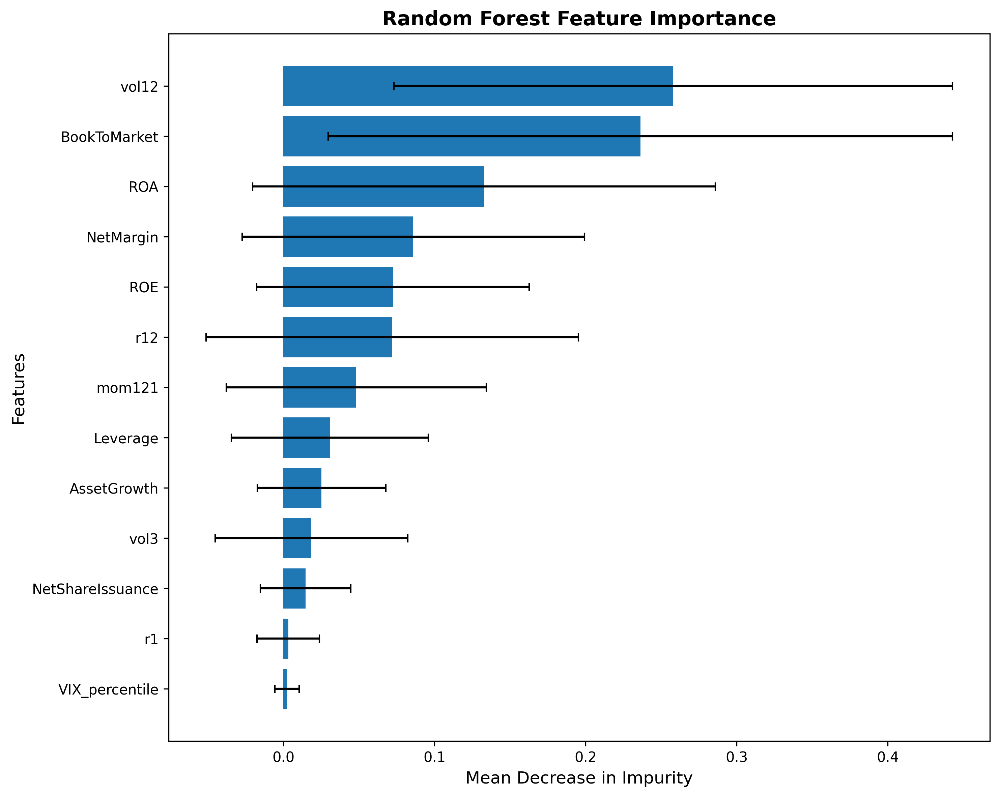

# Financial-ML

A machine learning system for equity selection that predicts which S&P 500 stocks will outperform the market benchmark. The project combines market data with company fundamentals to construct long/short portfolios, using time series cross-validation to prevent lookahead bias and comprehensive backtesting to validate performance against SPY. The goal: identify stocks with positive alpha while maintaining robust risk management through systematic validation at both model and portfolio levels

## Key Results

| Metric | Value |
|--------|-------|
| **Sharpe Ratio** | **0.93** |
| **Annual Return** | **20.2%** |
| **Max Drawdown** | **-22.9%** |
| **Alpha vs Random** | **1.72%** |
| **Win Rate** | **69.8%** |

- **100% Long-Only Strategy:** Top 10% stocks, equal-weighted, monthly rebalancing
- **Transaction costs included:** 10 bps per trade, ~0.5% annual drag from 42% turnover
- **Regime awareness:** VIX-based features improve downside protection during volatile periods
- **Statistically significant:** Sharpe ratio outperformance (p < 0.001, Bonferroni-adjusted)


## Pipeline Architecture

The pipeline of this project follows a standard MLOps workflow: data ingestion → feature engineering → model training with time series cross-validation → portfolio construction → backtesting.


***
## Table of Contents
- [Features](#features)
- [Project structure](#project-structure)
- [Installation](#installation)
- [Quick start](#quick-start)
- [Data Collection](#data-collection)
- [Modelling](#modelling)
- [Evaluation](#evaluation)
- [Portfolio construction and backtesting](#portfolio-construction-and-backtesting)
- [Documentation](#documentation)


## Features

- Fetch the current S\&P 500 list, normalize tickers for the market data API, and persist the symbols table.
- Download monthly adjusted close prices for all S\&P 500 tickers and the benchmark instrument, writing tidy CSVs for full or test universes.
- Retrieve selected fundamentals (assets, liabilities, equity, revenues, net income, EPS, shares outstanding) from public filings and save as a long-format CSV.
- Combine fundamentals and market information to produce ticker features: 13 features across **market signals** (momentum, volatility), **fundamentals** (value, quality, structure), and **regime indicators** (VIX percentile).
- Define an excess-return land evaluate baseline classifiers with expanding-window time series splits.
- Produce out-of-fold predictions per date and ticker for analysis and diagnostics.
- Use Random Forest predictions to construct **100% long-only portfolios** (top 10% confidence) with monthly rebalancing and 3-month smoothing.
- Assess the model robustness and the qualities of the portfolios (e.g. Sharpe ratios,  profits, risks, volatity vs SPY). 

## Project structure
The project is structured as follows (**For a more detailed explanation please refer to** [`docs/methodology.md`](docs/methodology.md)
):
```python
financial-ml/
├── src/financial_ml/ # Source code
│ ├── cli/ # Command-line interface components
│ ├── data/ # Data pipeline & feature engineering
│ ├── models/ # Training with time series CV
│ ├── evaluation/ # Model diagnostics
│ └── portfolio/ # Backtesting & construction
├── docs/ # Technical documentation
├── figures/ # Performance charts
└── requirements.txt
```

### Key Modules

**Data Pipeline (`data/`):**
- Downloads market data (yfinance) and fundamentals (SEC EDGAR)
- Engineers 13 features across market, fundamental, and sentiment categories
- Handles missing data and forward-fills quarterly fundamentals

**Model Training (`models/`):**
- 3-fold expanding window time series CV
- Trains Random Forest with VIX-based regime features
- Saves trained models and predictions

**Evaluation (`evaluation/`):**
- Feature importance analysis
- Model diagnostics (AUC, calibration metrics)
- Cross-fold performance comparison

**Portfolio Construction (`portfolio/`):**
- Selects top 10% stocks by predicted probability
- Constructs 100% long-only portfolios with monthly rebalancing
- Backtests against SPY benchmark with comprehensive diagnostics

### Output & Artifacts

After running the pipeline:

- **Predictions:** `data/predictions/` - Out-of-fold predictions with probabilities
- **Models:** `models/` - Trained model artifacts (.pkl files)
- **Visualizations:** `figures/` - Portfolio performance charts, feature importance
- **Logs:** `logs/` - Training and execution logs

> For detailed directory structure, see [`docs/methodology.md`](docs/methodology.md#generated-directories).

## Installation

**Requirements:** Python ≥ 3.10

### Quick Install

```python
# Clone repository
git clone https://github.com/pmatorras/financial-ml.git
cd financial-ml

# Create virtual environment (recommended)
python -m venv .venv
source .venv/bin/activate  # Windows: .venv\Scripts\activate

# Install package in editable mode
pip install -e .
```

### Reproducible Install

For exact dependency versions used in development:

```python
pip install -r Requirements.txt
pip install -e .
```

>**Note:** The package will be installed as `financial_ml` and can be run via `python -m financial_ml <command>`.

## Quick start

### Complete ML Pipeline

Run the full pipeline from data collection to backtesting:
```python
# 1. Collect market, fundamentals, and sentiment data
python -m financial_ml market
python -m financial_ml fundamentals
python -m financial_ml sentiment

#2. Train models
python -m financial_ml train

#3. Anayse training results
python -m financial_ml analyze

#4. Create portfolio and backtests
python -m financial_ml portfolio --model rf
```
**Output:** Models saved to `models/`, predictions to `predictions/`, and performance plots to `figures/`.

**Faster alternative using the [Makefile](Makefile):**
```makefile
make data #collect all data
make train #train models only
make backtest #Analyse training results and do portfolio
```
### Fast Development Mode

For quick iterations using a subset of ~50 stocks:

```python
# Download test subset
python -m financial_ml market --test

# Train on subset (market features only, faster)
python -m financial_ml train --test --market-only

# Backtest
python -m financial_ml portfolio --model rf --test
```

### Global Flags

Available for all commands:

**`--test`**
- Uses subset of ~50 stocks instead of full S&P 500
- Appends `_test` suffix to data files

**`--debug`**
- Enables verbose logging
- Designed for pipeline validation with minimal data (1-2 stocks)
- Saves artifacts to `debug/` directories with `_debug` suffix

**`--do-sentiment`**
- Includes VIX-based sentiment features
- Improves regime awareness during volatile periods

**`--market-only`**
- Use only market features (excludes fundamentals)
- Faster for experimentation and baseline comparisons

**Examples:**
```python
#Development mode (small subset)
python -m financial_ml train --test

#Debug mode (verbose logging + debug artifacts)
python -m financial_ml train --debug

#Combined for troubleshooting
python -m financial_ml train --test --debug
```

> **Tip:** Use `python -m financial_ml --help` to see all available commands and flags.
  

## Data Collection

<a id="data-usage"></a>
### Usage

```python
# 1. Download S&P 500 constituent list and prices
python -m financial_ml market

# 2. Download company fundamentals from SEC EDGAR
python -m financial_ml fundamentals

#3. Download sentiment data
python -m financial_ml sentiment 
```
**Command specific flags**

- `--newtable`/`-nt`: Refresh S&P 500 constituent list from public source
- `--newinfo`/`-ni`: Redownload all historical price data (ignores cache)

**Caching behaviour:** By default, data files are only downloaded if they don't already exist. Use `--newtable` and `--newinfo` to force refresh.

> **Note:** Market data collection and fundamentals collection are separate commands to enable independent execution. You can update constituents and prices without re-fetching fundamentals, or vice versa.

### Data sources 
Two types of data are currently considered: market and fundamental data:
1. **Market Data** (via `yfinance`)
    - **Universe:** S\&P 500 constituents scraped from public reference
    - **Prices:** Monthly adjusted close prices for all symbols + SPY benchmark
    - **Normalization:** Ticker symbols standardized for API compatibility

2. **Fundamental Data** (via SEC EDGAR API)
    - **Source:** Company 10-K/10-Q filings
    - **Tags:** Selected US-GAAP financial metrics (revenues, assets, equity, etc.)
    - **Processing:** Point-in-time series, de-duplicated by metric/unit/date
    - **Variants:** Multiple tag variants to handle company-specific reporting differences

3. **Sentiment data** (via `yfinance`)
> **Note:** Some fundamentals use different US-GAAP tag variants (e.g., `Revenues`, `RevenueFromContractWithCustomerExcludingAssessedTax`) to capture data across different reporting formats.

### Target Variable

**Binary classification:** Predict whether a stock will outperform the S\&P 500 benchmark.

**Label definition:** `y = 1` if stock's 12-month forward return exceeds SPY's 12-month forward return, else `y = 0`.

This creates a **relative momentum** signal focused on identifying stocks that beat the market, suitable for long/short portfolio construction.

***

## Modelling

<a id="modelling-usage"></a>
### Usage

```python
# Train with fundamentals with sentiment (default)
python -m financial_ml train --do-sentiment

# With no sentiment data
python -m financial_ml train 

# Market data only (skip fundamentals)
python -m financial_ml train --market-only
```


#### Command specific tags
- `--do-sentiment` - Include `VIX` data (default).
- `--only-market` - Train using only market data (excludes fundamental ratios)
- `--save` - Saves model results.
### Features

The model uses **13 features** spanning market and fundamental factors:

**Market Signals (4):**
- Momentum: `r12`, `mom121` (12-month trend)
- Volatility: `vol3`, `vol12` (risk measures)
- Price: `ClosePrice` (behavioral signal)

**Fundamental Ratios (9):**
- Value: `BookToMarket`
- Quality: `ROE`, `ROA`, `NetMargin`
- Structure: `Leverage`, `AssetGrowth`, `NetShareIssuance`

**Sentiment (1):**
- Regime: `VIXpercentile` (12-month rolling percentile for market stress detection)

> Note: `ClosePrice` and `LogMktCap` were tested but excluded—their information is already captured in returns and fundamental metrics.

>Full feature definitions and formulas in [`docs/methodology.md`](docs/methodology.md).

### Feature Importance:
Top features driving model predictions:

| Feature | Mean Importance | Interpretation |
|---------|-----------------|-----------------|
| **vol12** | 25.8% | 12-month volatility (quality/risk proxy) |
| **BookToMarket** | 23.6% | Value factor |
| **ROA** | 13.3% | Return on assets (profitability) |
| **NetMargin** | 8.6% | Operating efficiency |
| **VIXpercentile** | 0.23% | Regime indicator (critical in high-volatility periods) |



> **Note:** VIXpercentile has low average importance but provides critical protection during market stress. See [`docs/results.md`](docs/results.md) for a more detailed analysis of feature roles across market regimes.

### ML Models 

Three binary classifiers predict monthly stock outperformance vs. SPY benchmark:

- **Logistic Regression (L1)** - Lasso regularization, `C=0.5`
- **Logistic Regression (L2)** - Ridge regularization, `C=1.0`
- **Random Forest** - 50 trees, `max_depth=3`, `max_features='log2'` ← **Production model**
- **Random Forest (Calibrated)** - Isotonic calibration (portfolio performance: worse than random)
- **XGBoost, LightGBM, Gradient Boosting** - Boosting variants (overfit in weak-signal regimes)


> **Configuration:** See [`models/definitions.py`](src/financial_ml/models/definitions.py) for complete pipeline specifications.

**Preprocessing pipeline:**

- Sanitize infinite values → Replace with NaN
- Impute missing values → Median strategy
- Scale features → `StandardScaler` (linear models only)
- Balance classes → `class_weight='balanced'`

> Full model specifications: [`src/financial_ml/models/definitions.py`](src/financial_ml/models/definitions.py)

### Model Selection

Multiple models were evaluated using 3-fold time series cross-validation:

| Model | Test AUC | Portfolio Sharpe | Result |
|-------|----------|-----------------|--------|
| Logistic Regression L1 | 0.558 | ~0.65 | Baseline |
| Logistic Regression L2 | 0.558 | ~0.65 | Baseline |
| **Random Forest** | **0.525** | **0.93** | ✅ **Production** |
| Random Forest (Calibrated) | 0.526 | 0.79 | Worse with VIX |
| XGBoost | 0.524 | 0.80 | Overfits |
| LightGBM | 0.526 | 0.78 | Overfits |
| Gradient Boosting | 0.526 | 0.84 | Overfits |

**Why Random Forest Wins:**
- Random forest generally outperforms boosting in weak-signal regimes (AUC ≈ 0.525)
- Maintains wider probability spread for portfolio selection
- Naturally learns regime-dependent interactions with VIXpercentile

> See [`docs/results.md`](docs/results.md) and [`docs/experiments.md`](docs/experiments.md) for detailed analysis. 


### Cross-Validation

**3-fold expanding window time series CV** to mimic production and prevent lookahead bias and data leakage:

| Fold | Train Period | Test Period | Test AUC |
|------|--------------|-------------|----------|
| 1 | 2010-2016 (6 yrs) | 2016-2018 (2 yrs) | 0.18 |
| 2 | 2010-2018 (8 yrs) | 2018-2021 (3 yrs) | 0.517 |
| 3 | 2010-2021 (11 yrs) | 2021-2025 (4 yrs) | 0.541 |

**Average Test AUC:** 0.525

***

## Evaluation

One can analyse trained model feature importance and coefficients without retraining, simply by retrieving the models training information.

### Usage

```python
python -m financial_ml analyze --model all #or any model in definitions.py
```

### Output

- **Feature importance plots** - Random Forest feature rankings saved to `figures/`
- **Coefficient plots** - Logistic Regression coefficients saved to `figures/`
- **Model correlation matrix** - Heatmap showing prediction agreement across all models

### What's Analysed

- **Random Forest** - Feature importance (Gini impurity reduction)
- **Logistic Regression** - Coefficient magnitudes and signs
- **Top features** - Ranked by contribution to predictions

> **Implementation:** See [`evaluation/feature_analysis.py`](src/financial_ml/evaluation/feature_analysis.py) for details
***

## Portfolio Construction and backtesting

Construct 100% long portfolios from model predictions and evaluate performance against SPY benchmark.

### Usage

```python
python -m financial_ml portfolio --model rf # Or any other model in definitions.py
```

### Strategy:

- Long top 10% of stocks by predicted probability
- Equal-weighted positions within each leg
- Rebalancing Monthly (last trading day)
- Smoothing 3-month rolling average to reduce noise and turnover

### Performance Metrics

| Metric | Description |
| :-- | :-- |
| **Cumulative Return** | Total portfolio return over backtest period |
| **Sharpe Ratio** | Risk-adjusted return (annualized) |
| **Max Drawdown** | Largest peak-to-trough decline |
| **Turnover** | Average monthly portfolio rebalancing |
| **Win Rate** | % of months outperforming SPY |
| **Turnover** | Average monthly portfolio churn |
| **Beta to SPY** | Market exposure and correlation |

### Diagnostics

- **Sector drift** - Portfolio sector allocation vs SPY over time
- **Model correlation** - Agreement between different model predictions
- **Regime performance** - Returns during calm vs volatile market periods

### Output

- **Performance charts** - Cumulative returns, drawdown and sector drieft plots saved to `figures/`
- **Backtest results** - Metrics printed to console

> **Implementation:** See [`portfolio/backtest.py`](src/financial_ml/portfolio/backtest.py)

***


## Documentation

This README provides a high-level overview. For detailed information, please refer to:

- **[`docs/experiments.md`](docs/experiments.md)** - Complete ablation studies, rejected approaches, lessons learned
- **[`docs/methodology.md`](docs/methodology.md)** - Technical implementation details, formulas, model specifications
- **[`docs/decisions.md`](docs/decisions.md)** - Design rationale for key choices (features, rebalancing frequency, etc.)


<br><hr>
[Back to top](#financial-ml)
