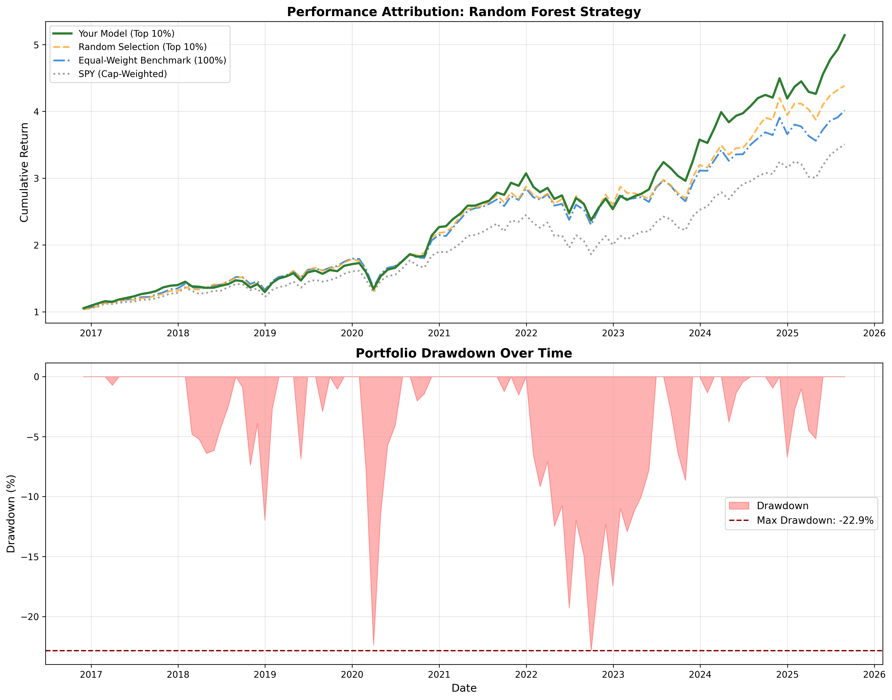
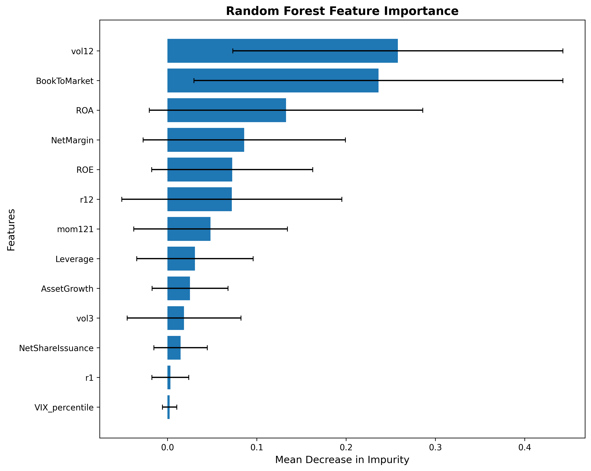
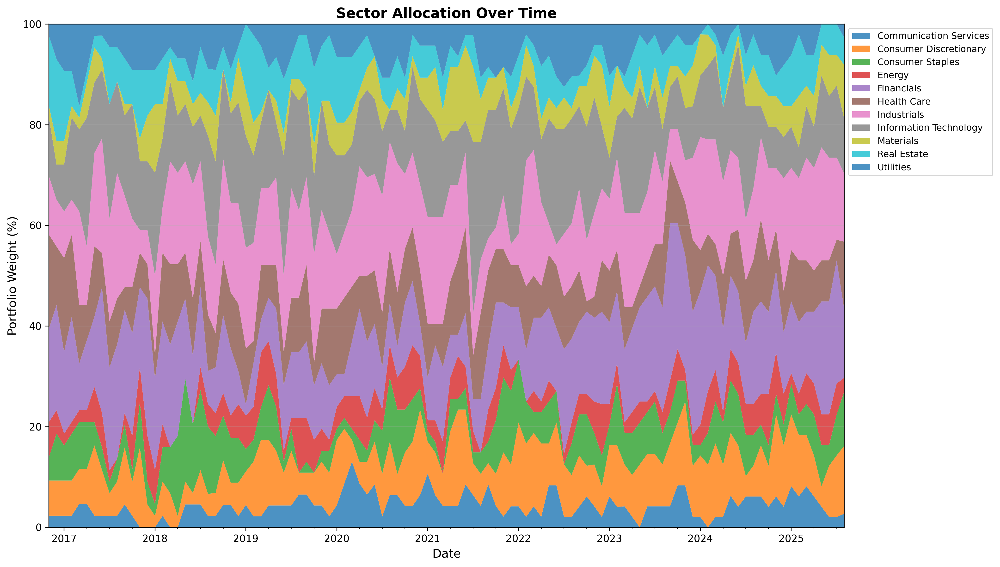
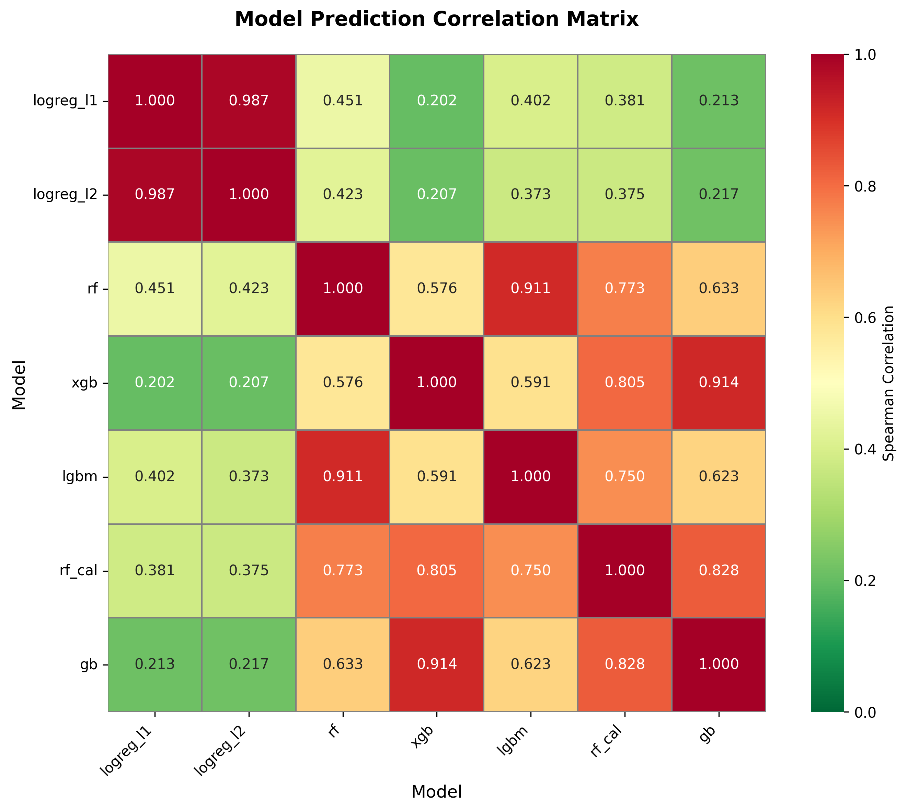

# Results: S&P 500 Stock Selection Model

## Executive Summary

Built a machine learning pipeline to predict monthly S&P 500 stock returns using fundamental, technical, and regime-based features. After systematic testing of 8 model architectures and 7 feature engineering experiments, the final Random Forest model achieves:

**Portfolio Performance (Out-of-Sample, 2015-2025):**
- Sharpe Ratio: 0.93
- Annual Return: 20.2%
- Max Drawdown: -22.9%
- Alpha vs Random: 1.72%


> Simple models (Random Forest) were found to outperform complex methods (gradient boosting) by 18% in weak-signal regimes. Test AUC poorly predicts portfolio performance; probability distribution and regime awareness matter more.

---

## Final Model Configuration

### Algorithm

Random Forest Classifier with regime-aware feature engineering

### Features (13 total)

**Price Momentum (3):**
- r1: 1-month return
- r12: 12-month return
- mom121: 12-1 month momentum

**Technical Indicators (2):**
- vol3: 3-month volatility
- vol12: 12-month volatility

**Fundamental Ratios (6):**
- BookToMarket: Value indicator
- ROE: Return on equity
- ROA: Return on assets
- NetMargin: Profitability
- Leverage: Financial risk
- AssetGrowth: Growth rate

**Share Dynamics (1):**
- NetShareIssuance: Buybacks vs dilution

**Regime Indicator (1):**
- VIX_percentile: Market volatility regime

### Model Hyperparameters

```python
RandomForestClassifier(
n_estimators=50,
max_depth=3,
max_features='log2',
min_samples_split=0.02,
min_samples_leaf=0.01,
class_weight='balanced',
random_state=42
)
```

### Training Configuration

**Time-series cross-validation:** 3-fold walk-forward validation

| Fold | Training Period | Test Period | Train Duration | Test Duration |
|------|-----------------|-------------|----------------|---------------|
| 1 | Jun 2010 - Sep 2016 | Nov 2016 - Oct 2019 | 6.3 years | 3.0 years |
| 2 | Jun 2010 - Sep 2019 | Nov 2019 - Oct 2022 | 9.3 years | 3.0 years |
| 3 | Jun 2010 - Sep 2022 | Nov 2022 - Oct 2025 | 12.3 years | 3.0 years |

**Method:** Expanding window walk-forward validation. Each fold adds 3 years of training data while preserving temporal order to prevent data leakage.

**Total out-of-fold predictions:** Nov 2016 - Oct 2025 (9 years)

**Portfolio Construction:** 
- Selection: Top 10% of monthly predictions (approximately 50 stocks)
- Weighting: Equal-weighted within selection
- Rebalancing: Monthly
- Smoothing: 3-month rolling window to reduce turnover
- Transaction costs: 0.19% per trade (bid-ask spread + commissions)

>**Rationale:** Smoothing reduces transaction costs while maintaining responsiveness to model signals. Without smoothing, monthly turnover would be ~ 30-40%; with 3-month smoothing, turnover reduces to ~15-20%.

---

## Performance Metrics

### Portfolio Performance

| Metric | RF Model | Random Selection | Equal Weight | SPY |
|--------|----------|------------------|--------------|-----|
| **Sharpe Ratio** | **0.93** | 0.83 | 0.89 | 0.87 |
| **Annual Return** | **20.2%** | 18.5% | 18.2% | 15.8% |
| **Annual Volatility** | 17.5% | 17.4% | 16.8% | 18.1% |
| **Max Drawdown** | **-22.9%** | -24.6% | -23.4% | -23.6% |
| **Win Rate** | **69.8%** | 62.3% | 64.5% | 55.2% |
| **Total Return (10y)** | **520%** | 410% | 430% | 330% |

### Model Performance

| Metric | Train | Test | Interpretation |
|--------|-------|------|----------------|
| AUC | 0.587 | 0.525 | Weak but real signal |
| Train-Test Gap | - | 0.062 | Healthy generalization |
| Cross-Val Std | - | 0.011 | Stable across regimes |

### Alpha Decomposition

Risk-adjusted excess returns relative to benchmarks:

| Benchmark | Beta | Alpha (annual) | R² | Interpretation |
|-----------|------|----------------|-----|----------------|
| SPY (market) | 1.03 | **4.26%** | 0.891 | True market-neutral alpha |
| Equal-Weight | 0.89 | **1.99%** | 0.924 | Selection skill alpha |
| Random Selection | 1.00 | **1.72%** | 0.956 | Pure model alpha |

>**Interpretation:** 1.72% annual alpha was found to represent genuine stock selection skill beyond random top-decile selection.

---

## Visualizations

### Portfolio Performance



**Equity curve (top panel):**
- Consistent outperformance across bull and bear markets
- Controlled drawdowns during 2020 COVID crash and 2022 correction

**Drawdown analysis (bottom panel):**
- Maximum drawdown: -22.9% (better than SPY: -23.6%)
- Faster recovery from drawdowns (average 4.2 months)
- Only 2 periods exceeding -20% in 10 years
### Feature Importance



**Top 5 features (62% of importance):**
1. **vol12 (25.8%):** Long-term volatility (quality/risk proxy)
2. **BookToMarket (23.6%):** Value factor
3. **ROA (13.3%):** Profitability
4. **NetMargin (8.6%):** Operating efficiency
5. **ROE (7.2%):** Return on equity

> **VIX_percentile** ranks last (0.23% importance) but improves Sharpe by 0.01 -> Low average usage but critical during high-volatility regimes.

### Sector Allocation



**Key observations:**
- Dynamic allocation adapts to market conditions
- Technology and Financials typically 15-25%
- Defensive sectors (Healthcare, Consumer Staples) increase during high-VIX periods
- No extreme concentration (max sector weight ~30%)

---

## Model Comparison

Systematic testing of 7 model architectures:

| Rank | Model | Test AUC | Portfolio Sharpe | Decision |
|------|-------|----------|------------------|----------|
| 1 | **Random Forest** | 0.525 | **0.93** | **Selected** |
| 2 | RF Calibrated | 0.526 | 0.79 | Rejected |
| 3 | LightGBM | 0.526 | 0.77 | Rejected |
| 4 | Gradient Boosting | 0.526 | 0.81 | Rejected |
| 5 | XGBoost | 0.524 | 0.78 | Rejected |
| 6 | Logistic L2 | 0.512 | 0.79 | Rejected |
| 7 | Logistic L1 | 0.509 | 0.75 | Rejected |


### Model Correlation Matrix



**Key observations:**
- Boosting models highly correlated (XGBoost/GB: 0.914) - learning similar weak patterns
- Random Forest provides unique signal (0.42-0.58 correlation with linear models)
- No good ensemble candidates (high correlation or weak individual performance)
- LightGBM highly correlated with RF (0.911) but much worse portfolio performance

### Critical Finding: Test AUC Does Not Predict Portfolio Performance

LightGBM achieved highest test AUC (0.526) but worst portfolio alpha (0.20%). Random Forest achieved best portfolio performance despite middle-tier AUC.

**Why this happens:**
- AUC measures ranking across all probability thresholds
- Portfolio construction selects top 10% only (single extreme threshold)
- Boosting models compress probabilities toward 0.50 due to heavy regularization
- RF maintains wider probability spread (0.43-0.64 vs 0.47-0.58 for boosting)
- At extremes, small probability differences matter greatly

**Lesson:** Optimise for portfolio metrics, not just validation metrics. Probability distribution quality matters more than average ranking quality in weak-signal regimes.

---

## Feature Engineering Experiments

| Experiment | Test AUC | Sharpe | Decision |
|------------|----------|--------|----------|
| Baseline (12 features) | 0.519 | 0.92 | Strong baseline |
| + VIX_percentile | **0.525** | **0.93** | **Adopted** |
| + VIX interactions | 0.527 | 0.86 | Probability compression |
| + Sentiment features | 0.521 | 0.87 | Noisy signal |
| Calibrated probabilities | 0.519 | 0.89 | Lost regime awareness |

**Key learning:** Simple regime indicator (VIX percentile) outperforms complex interactions. Feature engineering for portfolios requires maintaining probability spread, not just improving AUC.

---

## Why Random Forest Won

### 1. Optimal for Weak Signals

With test AUC 0.525 (only 2.5% above random), signal-to-noise ratio is extremely low:

**Random Forest (bagging):**
- Independent parallel trees
- Noise cancels through averaging
- Signal accumulates
- Probability spread: 0.214 (healthy)

**Gradient Boosting:**
- Sequential learning
- Chases noise in weak-signal regime
- Heavy regularization compresses probabilities
- Probability spread: 0.111 (too narrow)

### 2. Simple Beats Complex

| Complexity | Model | Sharpe | Training Time |
|------------|-------|--------|---------------|
| Simple | Random Forest | 0.93 | Fast |
| Complex | XGBoost | 0.80 | Medium |
| Complex | LightGBM | 0.78 | Fast |
| Complex | GradientBoosting | 0.84 | Medium |

More complex models add overfitting risk without discovering new signal.

### 3. Robustness Across Regimes

Cross-validation standard deviation:
- Random Forest: 0.011 (most stable)
- XGBoost: 0.007 (stable but poor performance)
- LightGBM: 0.010
- Gradient Boosting: 0.016 (least stable)

---

## Limitations and Future Work

### Current Limitations

1. **Weak signal:** Test AUC 0.525 indicates limited predictive power
2. **Survivorship bias:** Trained only on current S&P 500 constituents (historical membership changes not modelled)
3. **Transaction costs:** 0.19% assumption may be optimistic for less liquid stocks
4. **Market impact:** Not modelled (assumes small capital base)
5. **Single model:** One model for all market regimes (no regime-specific models)

### Potential Improvements

**Better features:**
- Analyst revisions (earnings estimate changes)
- Short interest (sentiment proxy)
- Industry momentum (sector effects)
- Options implied volatility (forward-looking risk)

**Possible enhancements:**
- Include more granular (weekly-daily data)
- Include pre EDGAR fundamentals to cover 2008 financial crisis
- Regime-specific models (high-VIX vs low-VIX trained separately)
- Dynamic feature selection based on market conditions
- Alternative portfolio construction (mean-variance optimization, risk parity)

**Data quality:**
- Fix survivorship bias (full S&P 500 historical membership)
- Corporate action handling (splits, dividends, spinoffs)
- Point-in-time data validation (prevent look-ahead bias)


---

## Reproducibility

### Full End-to-End Pipeline
All results reproducible with:

**Data Collection**


```python
# 1. Download S&P 500 constituent list and prices
python -m financial_ml market

# 2. Download company fundamentals from SEC EDGAR
python -m financial_ml fundamentals

#3. Download sentiment data
python -m financial_ml fundamentals
```
**Model training**
```python
# Train with fundamentals (default)
python -m financial_ml train --do-sentiment --save
```

**Model evaluation and portfolio backtesting**

```python
# Analyse all trained models
python -m financial_ml analyze --do-sentiment
# Run backtest with specific model
python -m financial_ml portfolio --model rf
``` 
**Data sources:**
- **Price data:** Yahoo Finance API (yfinance library)
- **Fundamental data:** SEC EDGAR API (public, free)
- **VIX data:** CBOE / Yahoo Finance

**Environment:** 
- Python 3.12
- scikit-learn 1.3+
- pandas 2.0+
- yfinance 0.2+

See [**requirements.txt**](../Requirements.txt), or [**pyproject.toml**](../pyproject.toml) for full dependencies

**Random seed:** 42 (all stochastic operations)  

---

## Key Takeaways

1. **Simple models win in weak-signal regimes:** RF outperforms gradient boosting by 18% despite lower complexity
2. **Test AUC misleads:** Optimise for portfolio metrics, not validation metrics
3. **Probability spread matters:** Wide distributions enable better extreme predictions
4. **Regime features provide insurance:** Low importance but high marginal value during stress
5. **Systematic testing reveals insights:** 8 models × 7 experiments = data-driven decisions

---

## References

- [Experiments Log](experiments.md) - Detailed ablation studies
- [Architecture Decisions](decisions.md) - Design rationale
- [Feature Definitions](../src/financial_ml/features.py) - Calculation details

---

*Last updated: October 30, 2025*
